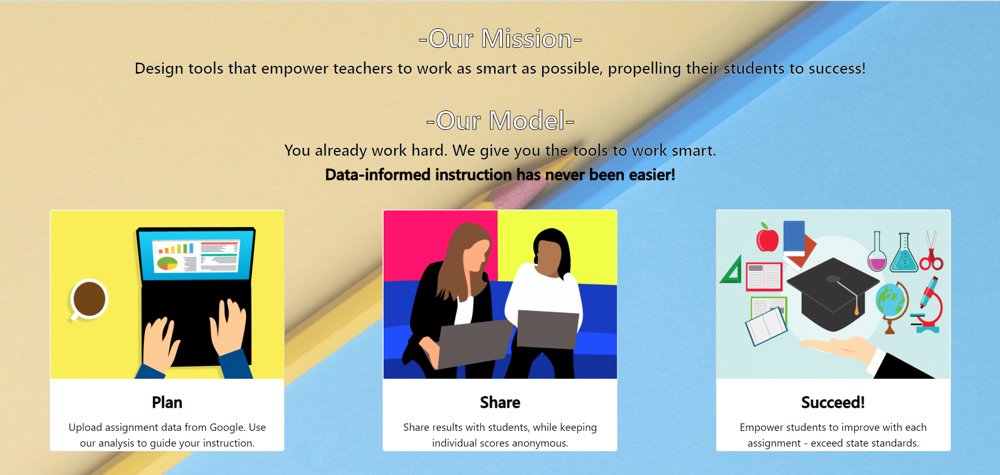
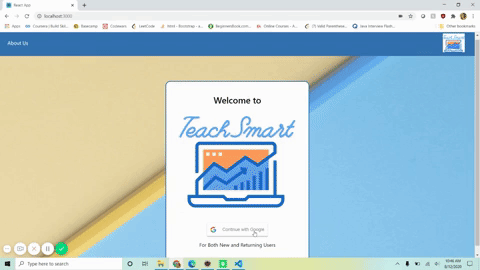
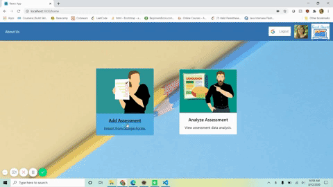
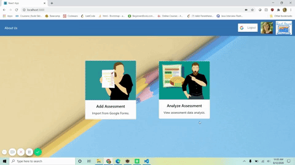

# teach-smart
 Web application for teachers to analyze & visualize Google Classroom assessment data.
 
## Take a Look!
#### About Us

#### Sign Up or Sign In

Integrated with Google Login. New users are prompted for permission to access both their Google Classroom & Google Sheets info. 
If this Google account is new to our site, a TeachSmart account is generated for the user. If the Google account is that of a returning user, that account is accessed.

#### Add Assessment

This feature utilizes Google APIs.
Users are provided with a list of their Google Classroom courses.
When they select a course, they are provided with a list of Google Classroom assignments from that course (only those which have a Google Form - assessments).
The user is provided with the link to the Google Sheet corresponding to that assignment. They download this as a tsv.
Upon upload to TeachSmart, the tsv is parsed and the assignment results are stored in the TeachSmart assignment database.

#### Analyze Assessment

Results for the chosen assignment are analyzed via several methods.
This information is displayed to the user with the chart.js library.
Teachers can use this information to plan their future lessons (such as reteaching key topics to classes that performed poorly) and share with students as well.

## Run this project on your machine:

1.Install Eclipse

2.Go to this path: File -> İmport -> Git -> Projects From Git ->  Clone URI

3.In the URI section copy and paste this: https://github.com/Charmaine-Burrus/teach-smart-spring-backend

4.In the same window, fill the user and password blanks with the username and password of your Github account.

5.Click Next several times to finish the importing the project.

6.To run the app, find Application.java in Project Explorer. Go to teach-smart-spring-backend -> src/main/java -> com.claim.teachsmart

7.Right clisk on TeachSmartApplication.java -> Run As -> Java Application

8.In order to experience the full functionality, also clone the teachsmart-assignments-microservice and teachsmart-react-frontend which are pinned on my profile page.

